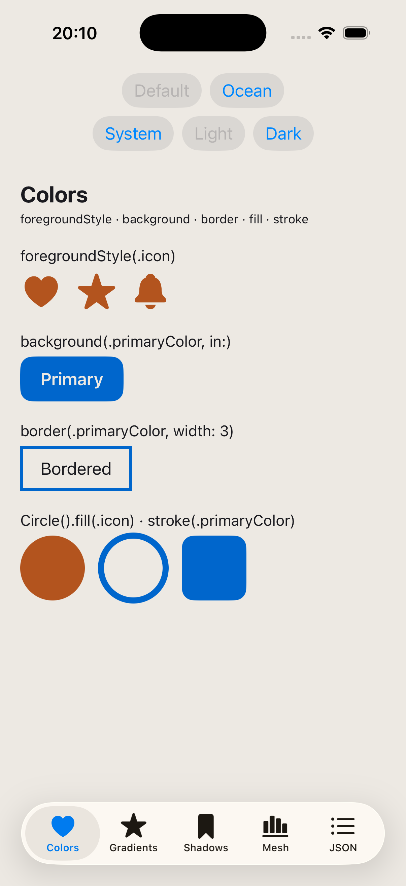
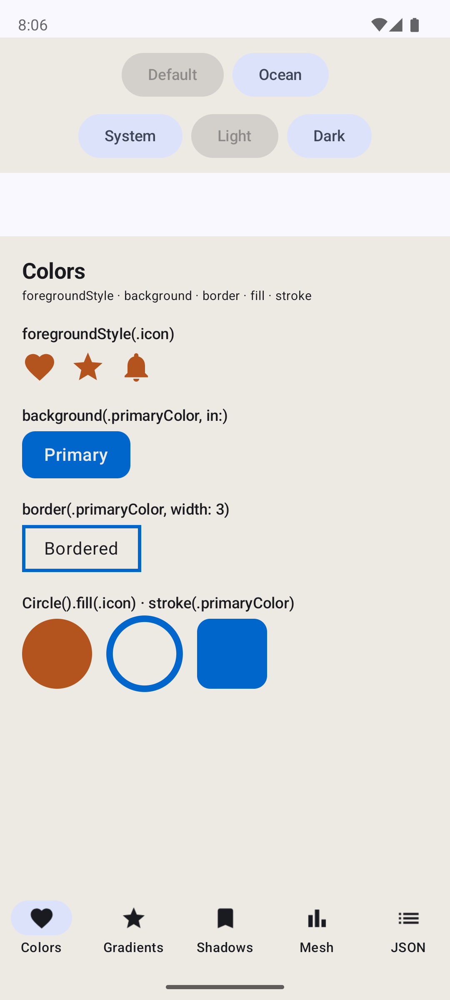
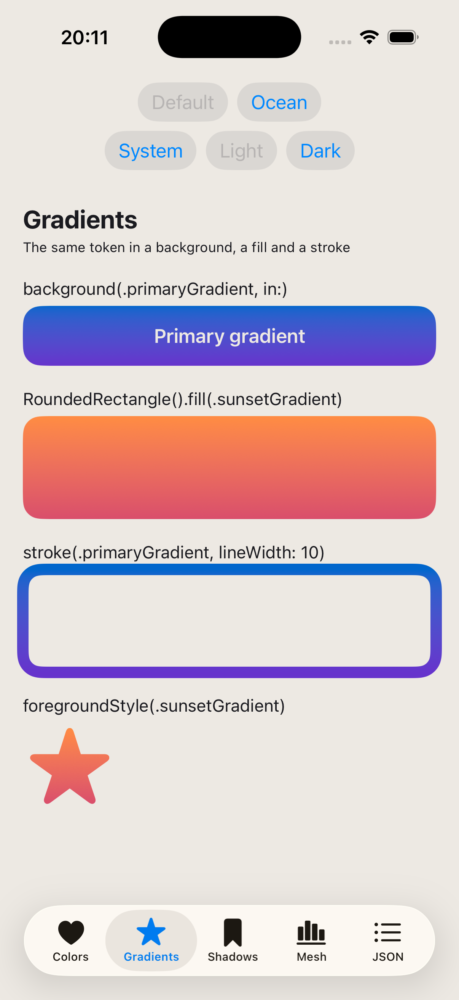
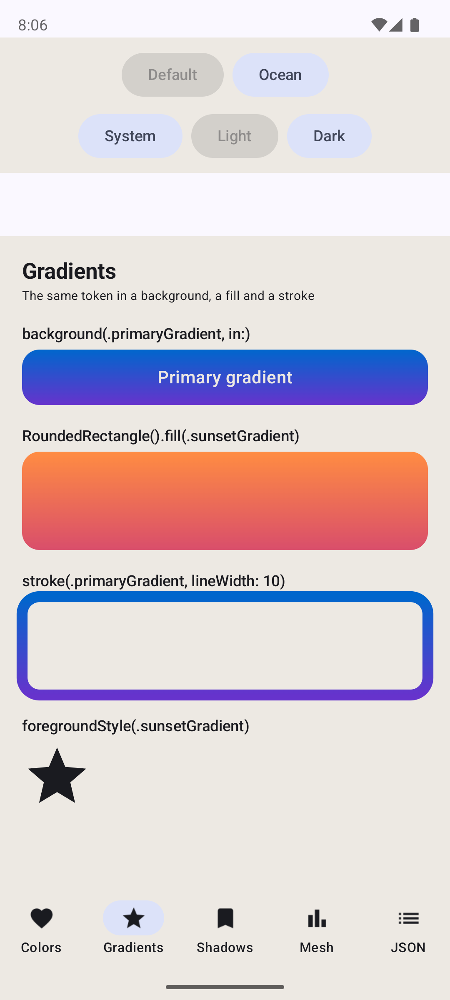
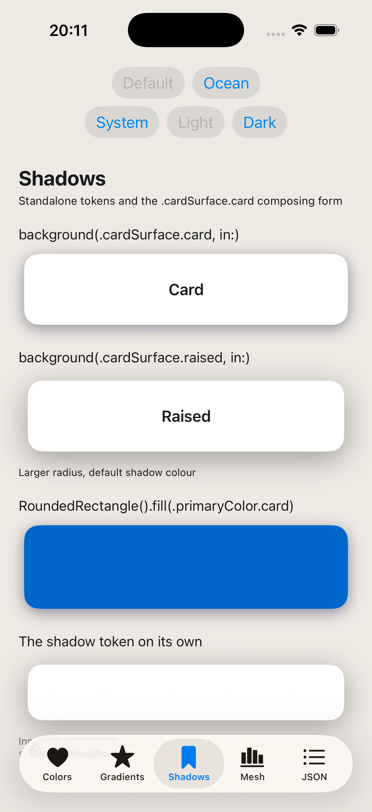
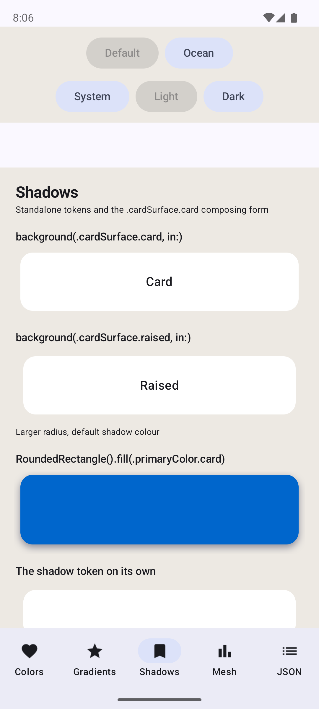
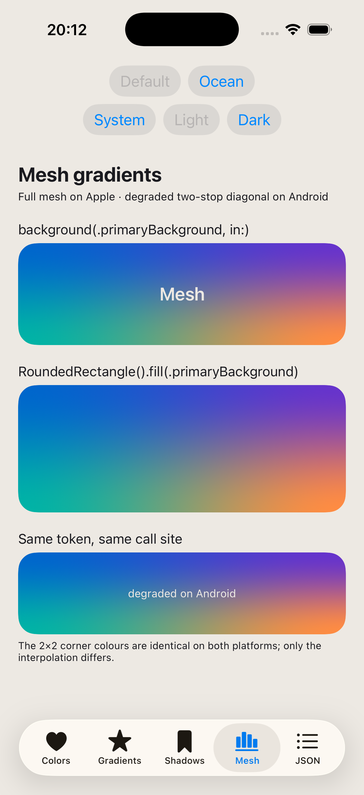
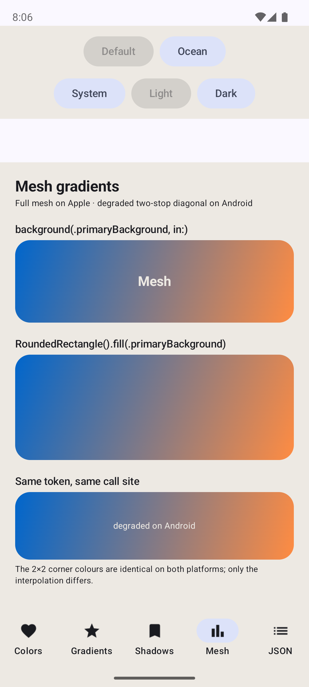
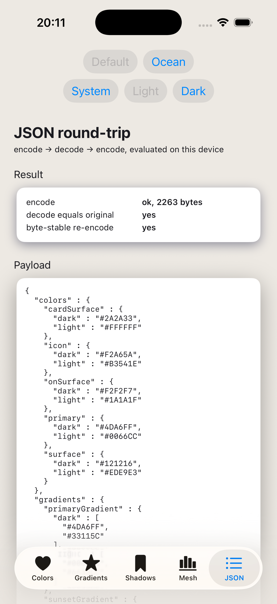
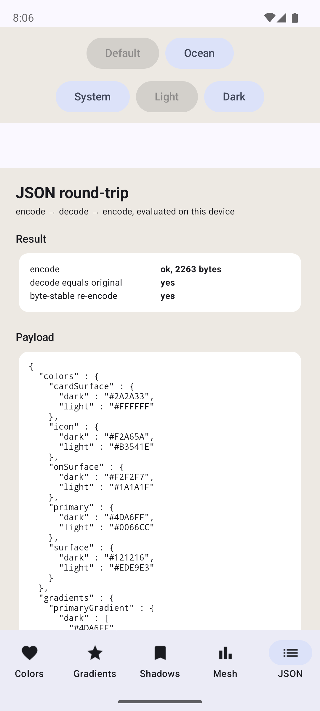

# ThemeKit Demo

A dual-platform [Skip](https://skip.dev) app demonstrating [ThemeKit](https://github.com/rozd/theme-kit)
on **iOS and Android from one source tree**.

The claim it exists to prove is narrow and checkable: theme tokens are spelled the same way on both
platforms. Nothing in `Sources/ThemeKitDemo/` contains `#if os(Android)`, and no screen resolves a token
by hand.

```swift
// Every screen in this app is written like this — and runs on both platforms.
Text("Primary")
    .foregroundStyle(.icon)
    .background(.primaryColor, in: RoundedRectangle(cornerRadius: 12))

RoundedRectangle(cornerRadius: 16)
    .fill(.cardSurface.card)          // colour token + shadow token, chained
```

## Parity

| | iOS | Android |
|---|---|---|
| Colors |  |  |
| Gradients |  |  |
| Shadows |  |  |
| Mesh |  |  |
| JSON |  |  |

Dark-mode captures and the full baseline, including which differences are expected, are in
[`Screenshots/`](Screenshots/README.md).

Two things worth looking at directly:

- **Mesh** is the one category that renders differently by design. Skip's SwiftUI facade has no
  `MeshGradient`, so ThemeKit ships its own and draws a two-stop diagonal between the mesh's first and
  last colours. Same corner colours, different interpolation.
- **JSON** encodes the live theme on device and shows the result. Both platforms report the same
  **2263 bytes**, decoding back to an equal value and re-encoding byte-identically — the round-trip
  that remote themes depend on, previously impossible on Android.

## Screens

`Colors` · `Gradients` · `Shadows` · `Mesh` · `JSON`, plus a theme picker (`.default` and a
`copyWith`-derived `.ocean`, switched at runtime) and an appearance picker.

## Running

An Android emulator must already be running for the Android leg.

```bash
skip app launch --android    # build, install and launch on the emulator
swift build                  # Apple-side compile
skip android build --plain   # Android cross-compile
```

iOS runs from `Darwin/ThemeKitDemo.xcodeproj`, scheme `ThemeKitDemo App`. Driving `xcodebuild` directly
needs `-skipPackagePluginValidation -skipMacroValidation` for the skipstone plugin.

## ThemeKit dependency

`Package.swift` uses `.package(path: "../theme-kit")` — the Android render path lives on ThemeKit's
integration branch and has not been released yet. Clone both repos as siblings:

```
~/dev/rozd/theme-kit
~/dev/rozd/theme-kit-demo
```

## Regenerating theme files

`theme.json` declares the tokens; `Sources/ThemeKitDemo/DesignSystem/Theme/` is generated from it.

```bash
swift package --allow-writing-to-package-directory generate-theme
```

`Theme+Defaults.swift` is the one generated file meant to be edited — it is scaffolded with
placeholders and filled in by hand. Author colours with `Color(hex:)`; colours built any other way
cannot encode on Android.
